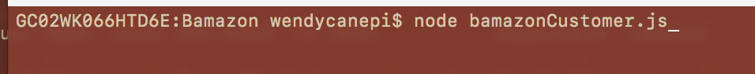
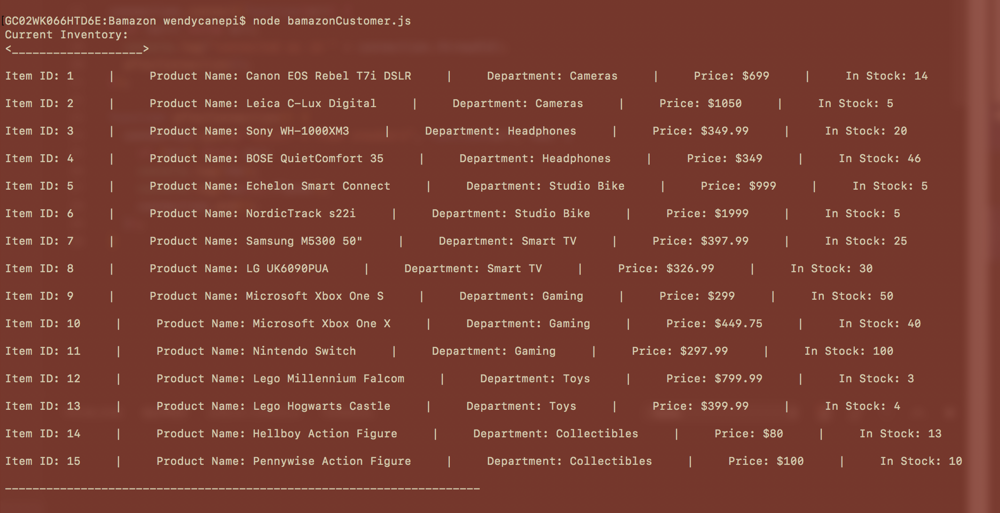
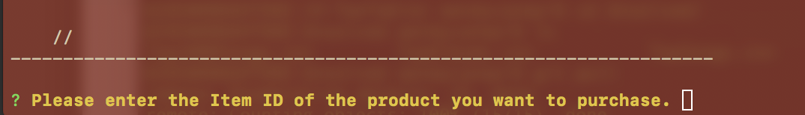
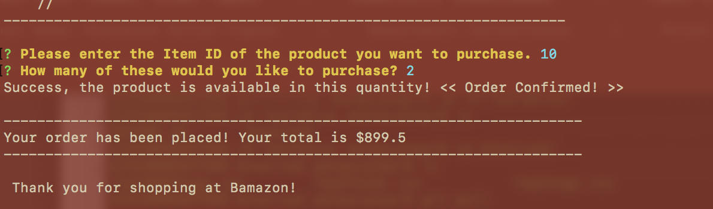

### Overview
## What is Bamazon?

**Bamazon** - a command-line (CLI) based storefront, built with Node.js, MySQL and Inquirer.

The **Bamazon** application functions as an Amazon-like storefront that takes orders from the customer and then depletes the "purchased" products from the store's inventory.

##How to run Bamazon##

```node bamazonCustomer.js```

###Let's step through the Bamazon experience: ###






